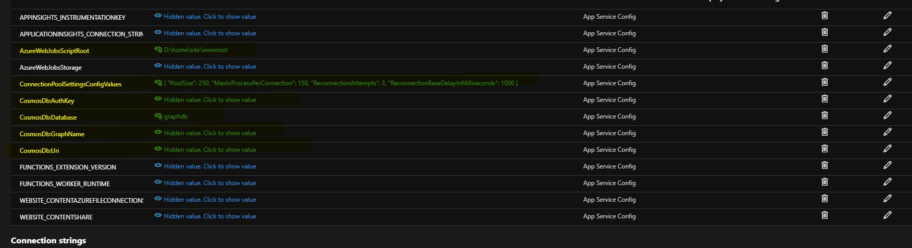

### we have two azure function  with same set of logic and method 

- GremlinIssueAzureFunctionV3 (Works perfectly fine)
- GremlinIssueAzureFunctionV4 (Works only for first request, after that return 503)


### Configuration we need in our azure function 
 - CosmosDb:Uri
   - example : wss://{ACCOUNT_NAME_HERE}.gremlin.cosmos.azure.com:443/
 - CosmosDb:Database
 - CosmosDb:GraphName (When creating graph we need to select **BucketNo** as partition key )
 - CosmosDb:AuthKey
 - ConnectionPoolSettingsConfigValues 
   - we have this as json

```
 {   "PoolSize": 250,  
     "MaxInProcessPerConnection": 150, 
     "ReconnectionAttempts": 3,  
     "ReconnectionBaseDelayInMilliseconds": 1000
 }
 ```
when running locally we have to convert this as string i.e .

>> {\"PoolSize\":250,\"MaxInProcessPerConnection\":150,\"ReconnectionAttempts\":3,\"ReconnectionBaseDelayInMilliseconds\":1000}
 - AzureWebJobsScriptRoot
   - we only need when running on azure

### Sample of azure app configuration


